# Introduction
The AI boom has affected us all, especially our capacity to purchase RAM, whose prices are still high. This resulted in me looking for alternatives to KDE and GNOME, both of which take a significant amount of RAM, leaving me less RAM than I wanted for my dev work on my humble machine with a meagre 8GB of RAM.

Combined with background services and development tools, idle RAM usage was higher than I was comfortable with on an 8 GB machine.

During my search, I came across various window managers and desktop environments that were lightweight, keyboard-oriented, and used minimal RAM.

## Who is this guide for?

This guide is aimed at users who:
- Want a lightweight Fedora setup
- Prefer keyboard-driven workflows
- Have limited RAM
- Enjoy customizing their desktop environment

# Choices, Choices...

If you have ever riced a linux machine, you are already familiar with the plethora of DEs, WMs and compositors out there. As such, you need to make a basic checklist of the features that you want from your machine before settling on one.

My checklist was:
- [ ] Needs to be light on resources
- [ ] Should be keyboard oriented
- [ ] Aesthetically pleasing
- [ ] Should be easy to configure & set up.
- [ ] Should work with the user, rather than against them.

These choices, I believe are quite sensible ones when considering a new environment. I did not want to write a new script for every functionality I wanted, nor did I want to use a bloated DE or WM.

[**Niri**](https://github.com/niri-wm/niri) was a good fit for my needs, combined with [**DMS**](https://danklinux.com/) for the bells and whistles. I also considered Noctalia with Niri, but since the project is still evolving, I decided to wait for it to mature a bit before diving in.

> [!NOTE]
> Niri is Wayland-only. Some older X11 applications may require XWayland compatibility packages like xwayland-satellite, which is already a dependency of Niri.

# Spinning up a minimal Fedora

Fedora comes in various spins, but each has its own set of pre-installed packages and configurations, many of which I had no particular use for. Hence I decided to go with the minimal Fedora installation, without any pre-installed packages or configurations.

> [!NOTE]
> The steps from here will wipe out your disks if you are not careful. Understand what you are doing before proceeding.
>
> Now is a good time to BACK UP your data.

> [!NOTE]
> You will need an internet connection for the installation process. It is better to have an ethernet cable handy or perhaps your phone with `USB Tethering`.

## Step 1: Downloads

Download the **Fedora Everything ISO** from the [Fedora website](https://fedoraproject.org/misc/).

> [!NOTE]
> Do not forget to download the [Fedora Media Writer](https://flathub.org/apps/details/org.fedoraproject.MediaWriter)
>
> And BRING A PENDRIVE.....

>[!NOTE]
> Contrary to what you might expect from the ISO's name, this is a net-installation, so you will need an internet connection to download packages during the installation process. 

## Step 2: Making a Bootable USB

1. Insert the USB drive into your computer.
2. Open the Fedora Media Writer application.
3. Select the Fedora Everything ISO you downloaded.
4. Click the "Flash" button to write the ISO to the USB drive.

At this point, you have your tool ready, to be inserted into your computer.

> [!CAUTION]
> **_WARNING_**: Make sure you have backed up your data before proceeding. The installation will wipe out all data on the target disk and you won't be able to recover it.

## Step 3: Installing Fedora from the USB Drive
At this point, you should have a bootable USB drive with the Fedora Everything ISO. Follow the below instructions to get a barebones working system. We will install the apps afterwards.

### Step 3.1: Boot from the USB Drive
Boot from the USB drive. You will be greeted with a language selection screen. 
<figure>
    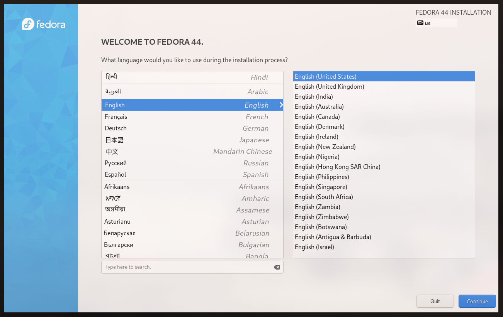
    <figcaption>Language Select Screen</figcaption>
</figure>

### Step 3.2: The Main Screen
This is the main screen which lists all the available options. Here, we will be changing the options to suit our needs:
1. Installation Destination
2. Software Selection
3. User Account Setup
The defaults for other settings were good enough for me.

<figure>
    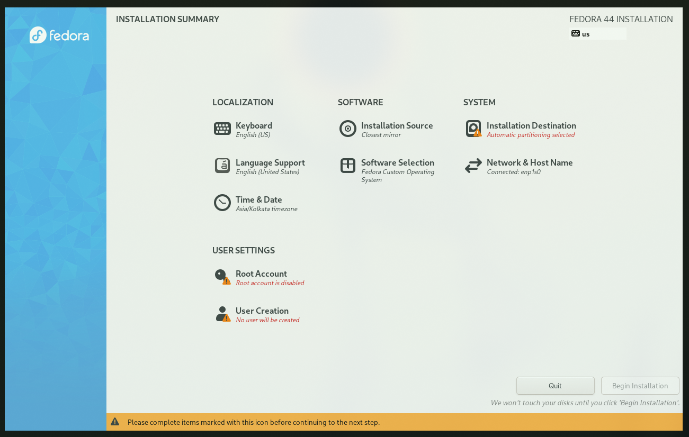
    <figcaption>Main Screen</figcaption>
</figure>

### Step 3.3: Software Selection
Here, select only two package groups:
1. Standard 
2. Common NetworkManager Submodules
These are shown in the image attached. Press `Done` to confirm your selection.
<figure>
    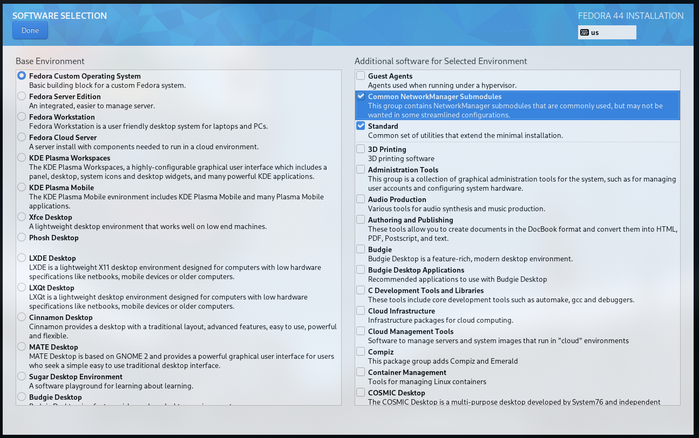
    <figcaption>Software Selection Screen</figcaption>
</figure>

### Step 3.4: User Creation
Here, create a user account for yourself. Press `Done` to confirm your selection.

> [!TIP]
> You can also change the hostname by going into `Network & HostName` on the main screen.

> [!NOTE]
> It is usually advised to not create a root user account. Instead, add you user account to the wheel group. This allows you to use `sudo` without being logged in as root. It is done by default on the installer. 

<figure>
    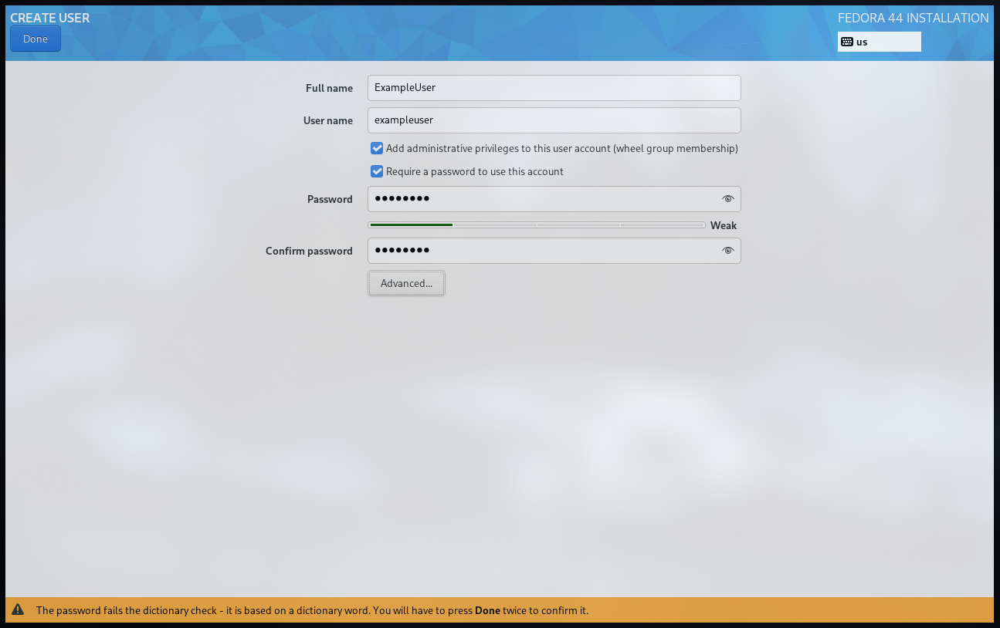
    <figcaption>User Creation Screen</figcaption>
</figure>

### Step 3.5: Partitioning the Disks
Fedora requires the following three partitions to be present on the disk:

| Partition | Size | MountPoint | Type | Description |
|-----------|------|------------|------|-------------|
| EFI | 512 MB     | `/boot/efi` | EFI | EFI System Partition |
| Boot | 1 GB     | `/boot` | ext4 | Boot Partition |
| Root |  Depends on your needs | `/` | ext4 or btrfs | Root Partition - This is the main partition where the OS will be installed and your data stored. |

Apart from this you can also create a `swap` partition if you need it. This is not required, but can be useful if you are running out of memory.

You can also have seperate `/home` partition if you need it. This is usually not necessary but allows you to keep your data and os separate from each other.

For this, first you need to select the disk on which you want to install the OS.
<figure>
    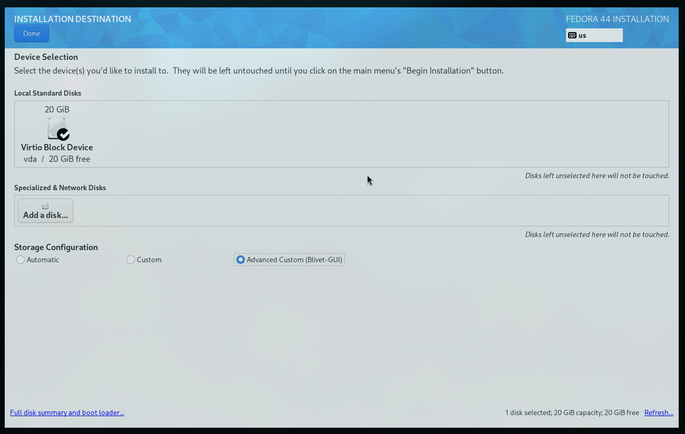
    <figcaption>Disk Selection Screen</figcaption>
</figure>

Then create the necessary three partitions on the disk.
<figure>
    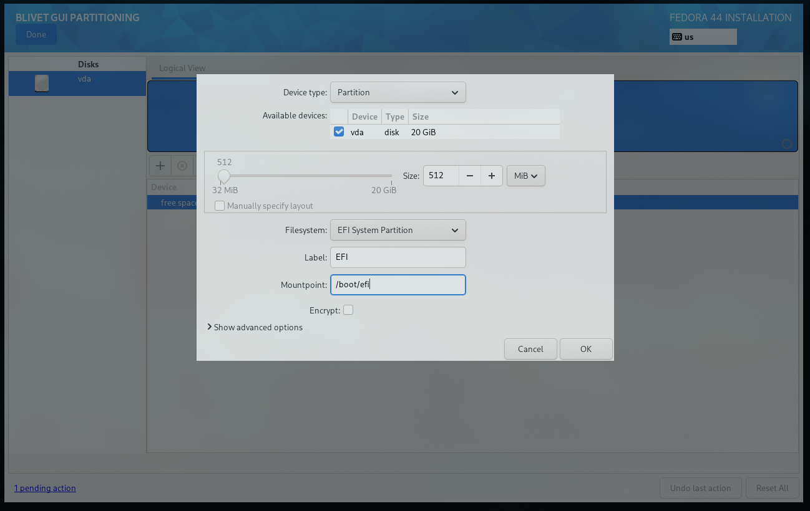
    <figcaption>EFI Partition</figcaption>
</figure>
<figure>
    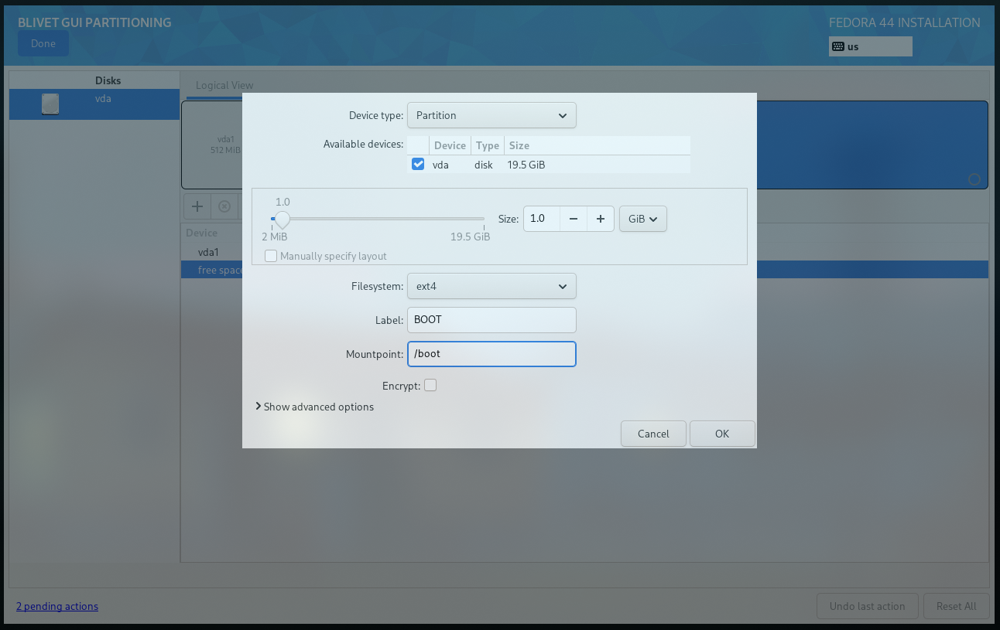
    <figcaption>Boot Partition</figcaption>
</figure>
<figure>
    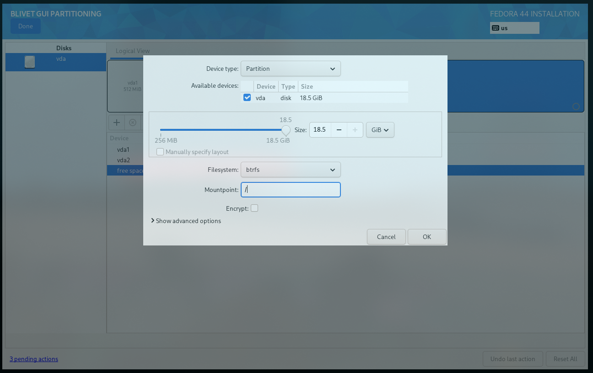
    <figcaption>Root Partition</figcaption>
</figure>


The final changes to the disk should look something like this: 
<figure>
    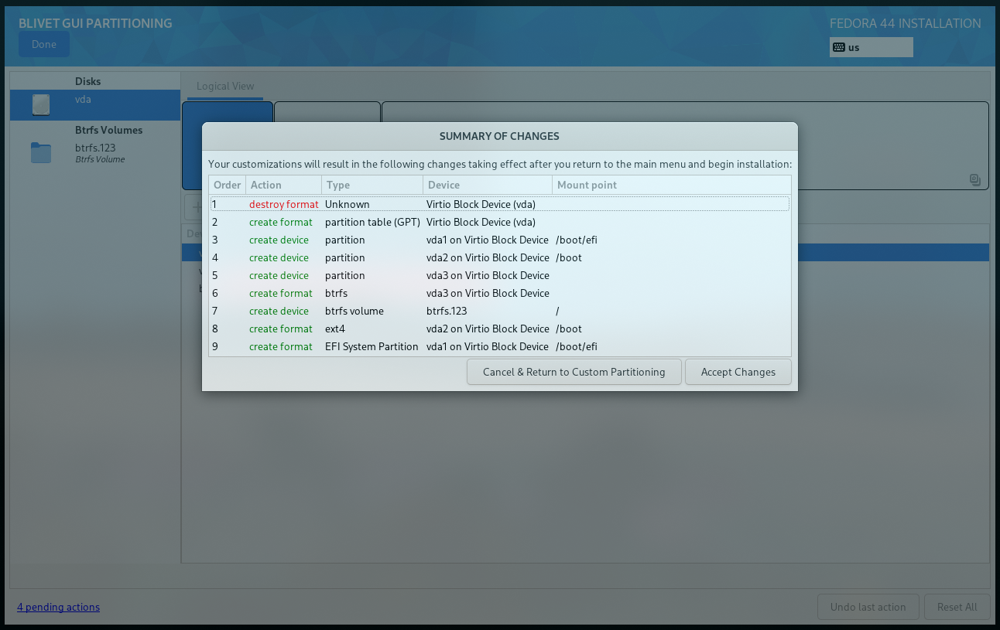
    <figcaption>Disk Layout</figcaption>
</figure>
This can have some deletions if you are deleting some partitions. Look carefully before pressing accept. Click the `Done` button to proceed with the installation.

### 3...2...1... Say bye to your Data...
Once the above steps are completed, you can click the `Begin Installation` button to start the installation process. This will apply all the changes you have made. 

<figure>
    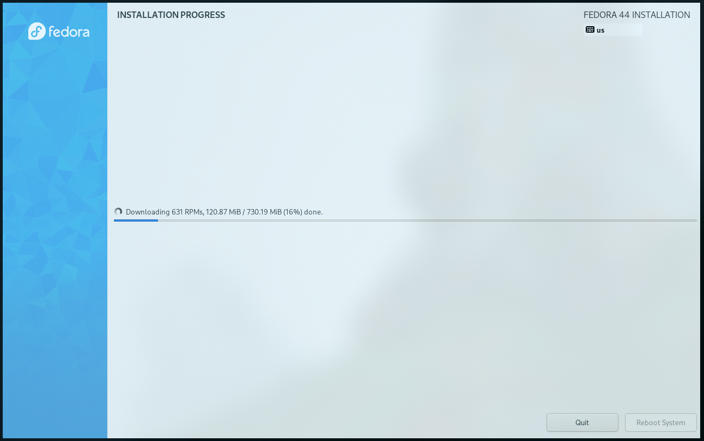
    <figcaption>A mere 730 MB of space</figcaption>
</figure>

The installation will take a few minutes to complete, depending on your internet speed and the speed of your disk.

Once the installation is complete, you will be prompted to reboot your system. Click the `Reboot` button to restart your computer.

# The Dawn of a New Era

## Welcome Bleakness!
The new screen you will face might be a bit bleak. It will be dark and empty, just as everything was before there was light.

<figure>
    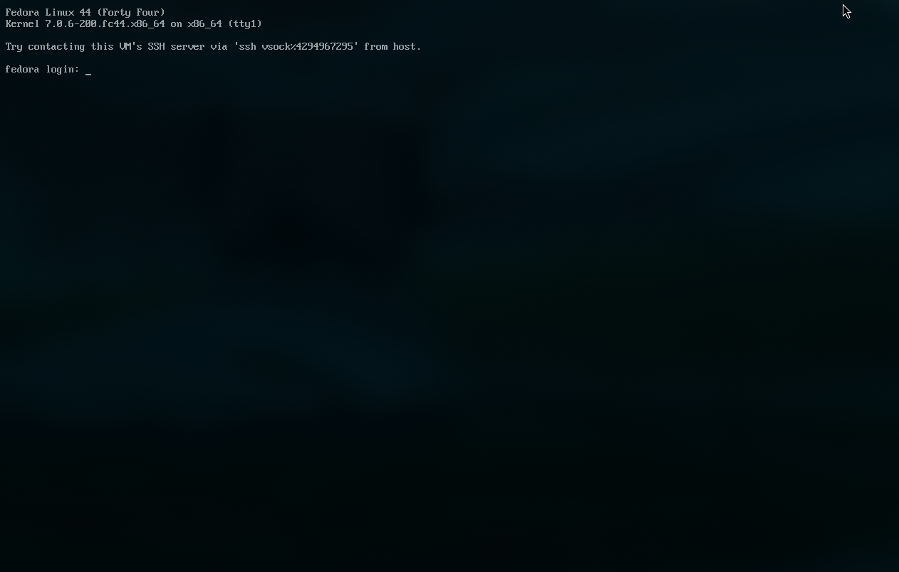
    <figcaption>A Bleak Experience</figcaption>
</figure>

This is the `TTY`, a full-screen, text-based login session provided directly by the Linux kernel.

Enter your credentials and login.

## Creating a Land
After you have logged in, you can start customizing your system.

> [!NOTE]
> You might an ethernet connection for a little bit here. There might be a possibility that the wifi modules are not yet installed. If you don't have an ethernet cable, you can connect your phone to the system and use the `USB Tethering` option for internet access.

For my install, I used the `Niri` with `DMS`. Let us install some necessities first. 

```shell
sudo dnf install -y \
  # Basic gnome utilities.
  gnome-keyring xdg-desktop-portal-gnome nautilus \
  # Wifi utilities.
  wpa_supplicant NetworkManager-wifi \
  # Qt6 theme utilities.
  qt6ct-kde
```

Now run the DMS install script. You can read more about it [here](https://danklinux.com/docs/getting-started).

```shell
# DMS Install Script
curl -fsSL https://install.danklinux.com | sh
```

Select the options you want in the installer script. Choose your terminal emulators and other preferences. It will automatically install the dependencies and set up your system.

Do not forget to also install the `DMS Greeter` as it provides the graphical login interface.

Reboot.

## Let there be Light

Enjoy your new Fedora system!

<figure>
  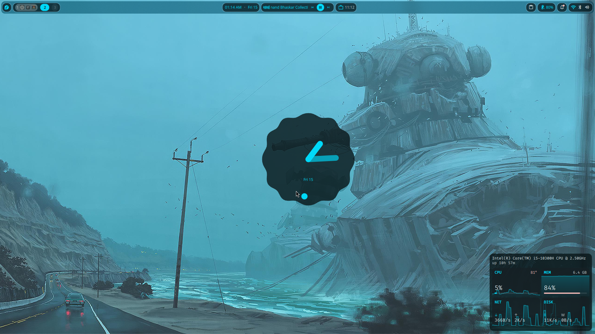
  <figcaption>My own Niri + DMS System</figcaption>
</figure>

<details>
  <summary>
      My Niri Configuration
  </summary>

  ```kdl
  // This config is in the KDL format: https://kdl.dev
  // "/-" comments out the following node.
  // Check the wiki for a full description of the configuration:
  // https://github.com/YaLTeR/niri/wiki/Configuration:-Introduction
  config-notification {
      disable-failed
  }
  
  gestures {
      hot-corners {
          off
      }
  }
  
  // Input device configuration.
  // Find the full list of options on the wiki:
  // https://github.com/YaLTeR/niri/wiki/Configuration:-Input
  input {
      keyboard {
          xkb {
              // You can set rules, model, layout, variant and options.
              // For more information, see xkeyboard-config(7).
  
              // For example:
              // layout "us,ru"
              // options "grp:win_space_toggle,compose:ralt,ctrl:nocaps"
  
              // If this section is empty, niri will fetch xkb settings
              // from org.freedesktop.locale1. You can control these using
              // localectl set-x11-keymap.
          }
  
          // Enable numlock on startup, omitting this setting disables it.
          numlock
      }
  
      // Next sections include libinput settings.
      // Omitting settings disables them, or leaves them at their default values.
      // All commented-out settings here are examples, not defaults.
      touchpad {
          // off
          tap
          // dwt
          // dwtp
          // drag false
          // drag-lock
          natural-scroll
          // accel-speed 0.2
          // accel-profile "flat"
          // scroll-method "two-finger"
          // disabled-on-external-mouse
      }
  
      mouse {
          // off
          // natural-scroll
          // accel-speed 0.2
          // accel-profile "flat"
          // scroll-method "no-scroll"
      }
  
      trackpoint {
          // off
          // natural-scroll
          // accel-speed 0.2
          // accel-profile "flat"
          // scroll-method "on-button-down"
          // scroll-button 273
          // scroll-button-lock
          // middle-emulation
      }
  
      // Uncomment this to make the mouse warp to the center of newly focused windows.
      // warp-mouse-to-focus
  
      // Focus windows and outputs automatically when moving the mouse into them.
      // Setting max-scroll-amount="0%" makes it work only on windows already fully on screen.
      // focus-follows-mouse max-scroll-amount="0%"
  }
  // You can configure outputs by their name, which you can find
  // by running `niri msg outputs` while inside a niri instance.
  // The built-in laptop monitor is usually called "eDP-1".
  // Find more information on the wiki:
  // https://github.com/YaLTeR/niri/wiki/Configuration:-Outputs
  // Remember to uncomment the node by removing "/-"!
  /-output "eDP-2" {
      mode "2560x1600@239.998993"
      position x=2560 y=0
      variable-refresh-rate
  }
  // Settings that influence how windows are positioned and sized.
  // Find more information on the wiki:
  // https://github.com/YaLTeR/niri/wiki/Configuration:-Layout
  layout {
      // Set gaps around windows in logical pixels.
      background-color "transparent"
      // When to center a column when changing focus, options are:
      // - "never", default behavior, focusing an off-screen column will keep at the left
      //   or right edge of the screen.
      // - "always", the focused column will always be centered.
      // - "on-overflow", focusing a column will center it if it doesn't fit
      //   together with the previously focused column.
      center-focused-column "never"
      // You can customize the widths that "switch-preset-column-width" (Mod+R) toggles between.
      preset-column-widths {
          // Proportion sets the width as a fraction of the output width, taking gaps into account.
          // For example, you can perfectly fit four windows sized "proportion 0.25" on an output.
          // The default preset widths are 1/3, 1/2 and 2/3 of the output.
          proportion 0.33333
          proportion 0.5
          proportion 0.66667
          // Fixed sets the width in logical pixels exactly.
          // fixed 1920
      }
      // You can also customize the heights that "switch-preset-window-height" (Mod+Shift+R) toggles between.
      // preset-window-heights { }
      // You can change the default width of the new windows.
      default-column-width { proportion 0.5; }
      // If you leave the brackets empty, the windows themselves will decide their initial width.
      // default-column-width {}
      // By default focus ring and border are rendered as a solid background rectangle
      // behind windows. That is, they will show up through semitransparent windows.
      // This is because windows using client-side decorations can have an arbitrary shape.
      //
      // If you don't like that, you should uncomment `prefer-no-csd` below.
      // Niri will draw focus ring and border *around* windows that agree to omit their
      // client-side decorations.
      //
      // Alternatively, you can override it with a window rule called
      // `draw-border-with-background`.
      border {
          off
          width 4
          active-color   "#707070"      // Neutral gray
          inactive-color "#d0d0d0"      // Light gray
          urgent-color   "#cc4444"      // Softer red
      }
      shadow {
          softness 30
          spread 5
          offset x=0 y=5
          color "#0007"
      }
      struts {
      }
  }
  layer-rule {
      match namespace="^quickshell$"
      place-within-backdrop true
  }
  overview {
      workspace-shadow {
          off
      }
  }
  // Add lines like this to spawn processes at startup.
  // Note that running niri as a session supports xdg-desktop-autostart,
  // which may be more convenient to use.
  // See the binds section below for more spawn examples.
  // This line starts waybar, a commonly used bar for Wayland compositors.
  environment {
    XDG_CURRENT_DESKTOP "niri"
    QT_QPA_PLATFORMTHEME "qt6ct"
    QT_QPA_PLATFORMTHEME_QT6 "qt6ct"
  }
  hotkey-overlay {
      skip-at-startup
  }
  prefer-no-csd
  screenshot-path "~/Pictures/Screenshots/Screenshot from %Y-%m-%d %H-%M-%S.png"
  animations {
      workspace-switch {
          spring damping-ratio=0.80 stiffness=523 epsilon=0.0001
      }
      window-open {
          duration-ms 150
          curve "ease-out-expo"
      }
      window-close {
          duration-ms 150
          curve "ease-out-quad"
      }
      horizontal-view-movement {
          spring damping-ratio=0.85 stiffness=423 epsilon=0.0001
      }
      window-movement {
          spring damping-ratio=0.75 stiffness=323 epsilon=0.0001
      }
      window-resize {
          spring damping-ratio=0.85 stiffness=423 epsilon=0.0001
      }
      config-notification-open-close {
          spring damping-ratio=0.65 stiffness=923 epsilon=0.001
      }
      screenshot-ui-open {
          duration-ms 200
          curve "ease-out-quad"
      }
      overview-open-close {
          spring damping-ratio=0.85 stiffness=800 epsilon=0.0001
      }
  }
  // Window rules let you adjust behavior for individual windows.
  // Find more information on the wiki:
  // https://github.com/YaLTeR/niri/wiki/Configuration:-Window-Rules
  // Work around WezTerm's initial configure bug
  // by setting an empty default-column-width.
  window-rule {
      // This regular expression is intentionally made as specific as possible,
      // since this is the default config, and we want no false positives.
      // You can get away with just app-id="wezterm" if you want.
      match app-id=r#"^org\.wezfurlong\.wezterm$"#
      default-column-width {}
  }
  window-rule {
      match app-id=r#"^org\.gnome\."#
      draw-border-with-background false
      geometry-corner-radius 12
      clip-to-geometry true
  }
  window-rule {
      match app-id=r#"^gnome-control-center$"#
      match app-id=r#"^pavucontrol$"#
      match app-id=r#"^nm-connection-editor$"#
      default-column-width { proportion 0.5; }
      open-floating false
  }
  window-rule {
      match app-id=r#"^org\.gnome\.Calculator$"#
      match app-id=r#"^gnome-calculator$"#
      match app-id=r#"^galculator$"#
      match app-id=r#"^blueman-manager$"#
      //match app-id=r#"^org\.gnome\.Nautilus$"#
      match app-id=r#"^xdg-desktop-portal$"#
      open-floating true
  }
  window-rule {
      match app-id=r#"^steam$"# title=r#"^notificationtoasts_\d+_desktop$"#
      default-floating-position x=10 y=10 relative-to="bottom-right"
      open-focused false
  }
  window-rule {
      match app-id=r#"^org\.wezfurlong\.wezterm$"#
      match app-id="Alacritty"
      match app-id="zen"
      match app-id="com.mitchellh.ghostty"
      match app-id="kitty"
      draw-border-with-background false
  }
  window-rule {
      match app-id=r#"firefox$"# title="^Picture-in-Picture$"
      match app-id="zoom"
      open-floating true
  }
  // Open dms windows as floating by default
  window-rule {
      match app-id=r#"org.quickshell$"#
      match app-id=r#"com.danklinux.dms$"#
      open-floating true
  }
  debug {
      honor-xdg-activation-with-invalid-serial
  }
  
  // Override to disable super+tab
  recent-windows {
      binds {
          Alt+Tab         { next-window scope="output"; }
          Alt+Shift+Tab   { previous-window scope="output"; }
          Alt+grave       { next-window filter="app-id"; }
          Alt+Shift+grave { previous-window filter="app-id"; }
      }
  }
  
  // Custom Configs
  window-rule {
      opacity 0.85
      background-effect{
          blur true
  
      }
  }
  
  // Indicate screencasted windows with red colors.
  window-rule {
      match is-window-cast-target=true
  
      focus-ring {
          active-color "#f38ba8"
          inactive-color "#7d0d2d"
          width 4
      }
  
      border {
          inactive-color "#7d0d2d"
      }
  
      shadow {
          color "#7d0d2d70"
      }
  
      tab-indicator {
          active-color "#f38ba8"
          inactive-color "#7d0d2d"
      }
  }
  
  
  // Startup Apps
  spawn-at-startup "ABDownloadManager"
  
  // Include dms files
  include "dms/colors.kdl"
  include "dms/layout.kdl"
  include "dms/alttab.kdl"
  include "dms/binds.kdl"
  include "dms/outputs.kdl"
  include "dms/cursor.kdl"
  
  include "dms/windowrules.kdl"
```
</details>

## Install the Necessities

### Enable 3rd Party Repositories

#### RPM Fusion
Required for non-free software that are not available in the official Fedora repositories.
```shell
sudo dnf install https://mirrors.rpmfusion.org/free/fedora/rpmfusion-free-release-$(rpm -E %fedora).noarch.rpm https://mirrors.rpmfusion.org/nonfree/fedora/rpmfusion-nonfree-release-$(rpm -E %fedora).noarch.rpm
```

#### Terra Repos
Maintained by [FyraLabs](https://fyralabs.com/), creators of UltraMarine Linux. Documentation can be found [here](https://terrapkg.com/).
```shell
sudo dnf install --nogpgcheck --repofrompath 'terra,https://repos.fyralabs.com/terra$releasever' terra-release
```

#### Check for Firmware Updates

```shell
fwupdmgr refresh --force
fwupdmgr get-devices # Lists devices with available updates.
fwupdmgr get-updates # Fetches list of available updates.
fwupdmgr update
```

#### AppImages
For Appimage support install FUSE. 
```shell
sudo dnf install fuse fuse-libs
```

#### Media Codecs
```shell
sudo dnf group install multimedia
sudo dnf swap 'ffmpeg-free' 'ffmpeg' --allowerasing # Switch to full FFMPEG.
sudo dnf update @multimedia --setopt="install_weak_deps=False" --exclude=PackageKit-gstreamer-plugin # Installs gstreamer components. Required if you use Gnome Videos and other dependent applications.
sudo dnf group install -y sound-and-video # Installs useful Sound and Video complementary packages.
```


#### NVIDIA Support & Hardware Acceleration
Look at this guide's NVIDIA Drivers Section: [Post-Install Guide](https://github.com/devangshekhawat/Fedora-44-Post-Install-Guide#nvidia-drivers)

Look at this guide's Hardware Acceleration Section: [Post-Install Guide](https://github.com/devangshekhawat/Fedora-44-Post-Install-Guide#hw-video-acceleration)

#### Set UTC Time 
This avoids time synchronization issues with the BIOS clock in dual-boot setups.
```shell
sudo timedatectl set-local-rtc '0'
```


### Code Editors

#### Visual Studio Code
Refer to [Microsoft's documentation](https://code.visualstudio.com/docs/setup/linux#_rhel-fedora-and-centos-based-distributions) for more details.
```shell
sudo rpm --import https://packages.microsoft.com/keys/microsoft.asc &&
echo -e "[code]\nname=Visual Studio Code\nbaseurl=https://packages.microsoft.com/yumrepos/vscode\nenabled=1\nautorefresh=1\ntype=rpm-md\ngpgcheck=1\ngpgkey=https://packages.microsoft.com/keys/microsoft.asc" | sudo tee /etc/yum.repos.d/vscode.repo > /dev/null
sudo dnf check-update &&
sudo dnf install code # or code-insiders
```

#### Zed
Refer to [Zed's documentation](https://zed.dev/docs/linux#other-ways-to-install-zed-on-linux) for more details.
```shell
sudo dnf install zed
```

### Terminals & TUI
```shell
sudo dnf install tmux fish \ # or zsh
  #Need the terra repos for this or follow the offical installation way
  starship
```

### Get the Zen Browser 

```shell
sudo dnf copr enable sneexy/zen-browser
sudo dnf install zen-browser
```

### Get Some Nerd Fonts

Head over to [Nerd Fonts](https://www.nerdfonts.com/) and download the font you like. Good for displaying icons in your terminal.

### Get Some Cool Wallpapers

There are a lot of cool wallpapers available on the web. You can find them on [Unsplash](https://unsplash.com/), [Pexels](https://www.pexels.com/), and [Wallhaven](https://wallhaven.cc/).

I use Simon Stalenhag's work as my wallpaper collection. 
A redditor uploaded scaled up versions at [r/WidescreenWallpaper](https://www.reddit.com/r/WidescreenWallpaper/comments/avafez/55_artworks_from_simon_st%C3%A5lenhag_upscaled_and/). You can check out the artist's work on [his website](https://www.simonstalenhag.se/).

# Tips
- You can install modern replacements for standard terminal commands like eza (ls), bat(cat), zoxide(cd), btop(top), etc.
- You can also change your shell to fish or zsh using `chsh`. I would recommend fish as it has a more feature-rich shell experience, however, it can be a bit daunting at first.
- If you are using an Asus laptop, check out [asus-linux.org](https://asus-linux.org/) for more information and tweaks.

# Results
After installing and customizing my Fedora setup, I ended up with a minimal, keyboard-oriented desktop environment that uses minimal RAM.

My current idle RAM usage is around 1-1.25GB, out of which Niri & DMS combined use around 400MB of RAM.

# Credits
- [Niri](https://github.com/niri-wm/niri)
- [Dank Material Shell](https://github.com/AvengeMedia/DankMaterialShell)
- Devang Shekhawat's [Post Install Guide for Fedora 44](https://github.com/devangshekhawat/Fedora-44-Post-Install-Guide)
